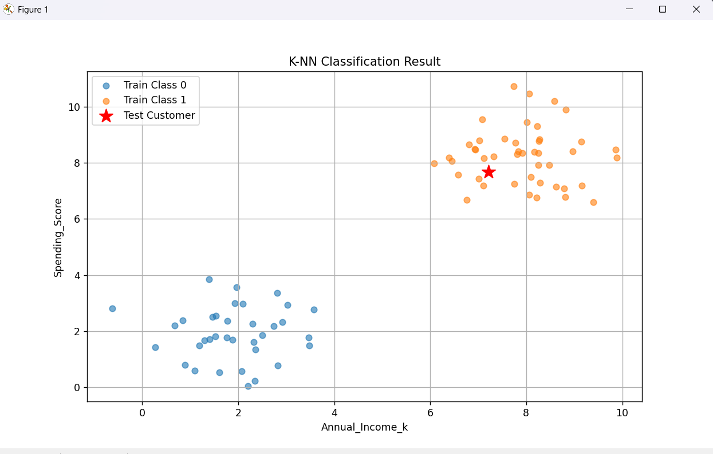

# Customer Segmentation Analysis: From Scratch

This activity implements **K-Nearest Neighbors (K-NN)** for classification and explores the dataset structure using manual implementations.

## Project Overview
* **Goal:** Classify customers into segments (0 or 1) based on their `Annual_Income_k` and `Spending_Score`.
* **Technique:** K-Nearest Neighbors (K-NN) algorithm implemented from scratch using NumPy.
* **Environment:** Python, NumPy, Pandas, Matplotlib.

## Implementation Details

### 1. K-NN Algorithm
The K-NN implementation calculates the Euclidean distance between a target customer and all points in the training set:
$$\text{Distance} = \sqrt{\sum (x_{test} - x_{train})^2}$$
It then identifies the $K$ nearest neighbors and performs a majority vote to predict the class label.

### 2. Data Preparation
* The dataset is split into **80% training data** and **20% testing data** using a custom shuffling function.
* The data is treated as a 2D coordinate system where features represent X and Y axes.

## Results
The model successfully classifies test points by analyzing their proximity to known labeled clusters.

**Visualization:**
The graph below depicts the training clusters (Blue: Class 0, Orange: Class 1) and the test customer (Red Star) being classified.

**Prediction Accuracy:**
* **Prediction:** 1
* **Actual Label:** 1.0